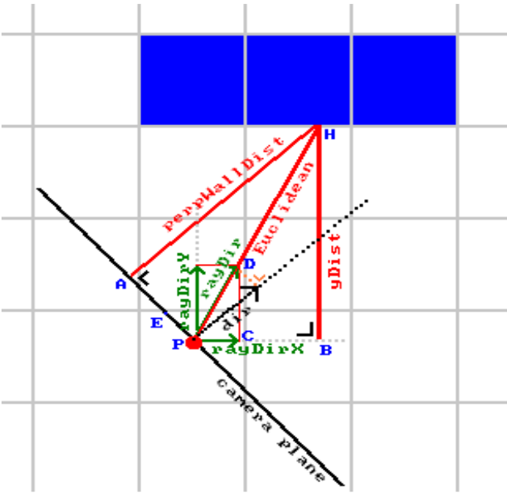
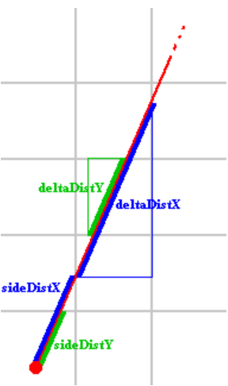

<h1 align="center">
	📖 cub3d
</h1>

	<b><i>My first RayCaster with miniLibX</i></b> 

<h3 align="center">
	<a href="#%EF%B8%8F-about">About</a>
	 · 
	<a href="#%EF%B8%8F-about">Current State</a>
</h3>

---

## 💡 About the project

| **Program name** | cub3D |
|------------------|-----------|
| **Turn in files**| All your files |
| **Makefile**     | all, clean, fclean, re, bonus |
| **Arguments**    | a map in format *.cub |
| **External functions** | open, close, read, write, printf, malloc, free, perror, strerror, exit + All functions of the math library (-lm man man 3 math) + All functions of the MinilibX |
| **Libft authorized** | Yes |
| **Description**  | You must create a “realistic” 3D graphical representation of the inside of a maze from a first-person perspective. You have to create this representation using the Ray-Casting principles mentioned earlier. |

✅ You must use the miniLibX. Either the version that is available on the operating
system, or from its sources. If you choose to work with the sources, you will
need to apply the same rules for your libft as those written above in Common
Instructions part.

✅ The management of your window must remain smooth: changing to another window,
minimizing, etc.

✅ Display different wall textures (the choice is yours) that vary depending on which
side the wall is facing (North, South, East, West).

Your program must be able to set the floor and ceiling colors to two different ones.

• The program displays the image in a window and respects the following rules:

✅ The left and right arrow keys of the keyboard must allow you to look left and
right in the maze.

✅ The W, A, S, and D keys must allow you to move the point of view through
the maze.

✅ Pressing ESC must close the window and quit the program cleanly.

✅ Clicking on the red cross on the window’s frame must close the window and
quit the program cleanly.

✅ The use of images of the minilibX is strongly recommended.

• Your program must take as a first argument a scene description file with the .cub
extension.

◦ The map must be composed of only 6 possible characters: 0 for an empty space,
1 for a wall, and N,S,E or W for the player’s start position and spawning
orientation.
The map must be closed/surrounded by walls, if not the program must return
an error.

◦ Except for the map content, each type of element can be separated by one or
more empty line(s).

◦ Except for the map content which always has to be the last, each type of
element can be set in any order in the file.

◦ Except for the map, each type of information from an element can be separated
by one or more space(s).

◦ The map must be parsed as it looks in the file. Spaces are a valid part of the
map and are up to you to handle. You must be able to parse any kind of map,
as long as it respects the rules of the map.

Each element (except the map) firsts information is the type identifier (composed
by one or two character(s)), followed by all specific informations for each
object in a strict order such as :

∗ North texture:

	NO ./path_to_the_north_texture
-  identifier: NO 

- path to the north texure

∗ South texture:

	SO ./path_to_the_south_texture
- identifier: SO
- path to the south texure
- 
∗ West texture:

	WE ./path_to_the_west_texture
- identifier: WE
- path to the west texure
- 
∗ East texture:
	
	EA ./path_to_the_east_texture
- identifier: EA
- path to the east texure
- 
∗ Floor color:

	F 220,100,0
- identifier: F
- R,G,B colors in range [0,255]: 0, 255, 255

Ceiling color:
	
	C 225,30,0
- identifier: C
- R,G,B colors in range [0,255]: 0, 255, 255

- Example of the mandatory part with a minimalist .cub scene:

		NO ./path_to_the_north_texture
		SO ./path_to_the_south_texture
		WE ./path_to_the_west_texture
		EA ./path_to_the_east_texture
		F 220,100,0
		C 225,30,0
		1111111111111111111111111
		1000000000110000000000001
		1011000001110000000000001
		1001000000000000000000001
		111111111011000001110000000000001
		100000000011000001110111111111111
		11110111111111011100000010001
		11110111111111011101010010001
		11000000110101011100000010001
		10000000000000001100000010001
		10000000000000001101010010001
		11000001110101011111011110N0111
		11110111 1110101 101111010001
		11111111 1111111 111111111111

-  If any misconfiguration of any kind is encountered in the file, the program
must exit properly and return "Error\n" followed by an explicit error message
of your choice.

## State of the project

❌ Parser
❌ Floodfill
✅ Raycasting
✅ Gameplay

## ray scheme

For the raycasting the lodev explanation has been used. The full detailed explanation can be accessed on his site https://lodev.org/cgtutor/raycasting.html#The_Basic_Idea_, but this is a summary of the main key ideas it explains:

Meaning of the points:

P: position of the player, (posX, posY) in the code
H: hitpoint of the ray on the wall. Its y-position is known to be mapY + (1 - stepY) / 2
yDist matches "(mapY + (1 - stepY) / 2 - posY)", this is the y coordinate of the Euclidean distance vector, in world coordinates. Here, (1 - stepY) / 2) is a correction term that is 0 or 1 based on positive or negative y direction, which is also used in the initialization of sideDistY.

dir: the main player looking direction, given by dirX,dirY in the code. The length of this vector is always exactly 1. This matches the looking direction in the center of the screen, as opposed to the direction of the current ray. It is perpendicular to the camera plane, and perpWallDist is parallel to this.

orange dotted line (may be hard to see, use CTRL+scrollwheel or CTRL+plus to zoom in a desktop browser to see it better): the value that was added to dir to get rayDir. Importantly, this is parallel to the camera plane, perpendicular to dir.
A: point of the camera plane closest to H, the point where perpWallDist intersects with camera plane
B: point of X-axis through player closest to H, point where yDist crosses the world X-axis through the player
C: point at player position + rayDirX
D: point at player position + rayDir.
E: This is point D with the dir vector subtracted, in other words, E + dir = D.
points A, B, C, D, E, H and P are used in the explanation below: they form triangles which are considered: BHP, CDP, AHP and DEP.

The actual derivation:

1: Triangles PBH and PCD have the same shape but different size, so same ratios of edges

2: Given step 1, the triangles show that the ratio yDist / rayDirY is equal to the ratio Euclidean / |rayDir|, so now we can derive perpWallDist = Euclidean / |rayDir| instead.

3: Triangles AHP and EDP have the same shape but different size, so same ratios of edges. Length of edge ED, that is |ED|, equals length of dir, |dir|, which is 1. Similarly, |DP| equals |rayDir|.

4: Given step 3, the triangles show that the ratio Euclidean / |rayDir| = perpWallDist / |dir| = perpWallDist / 1.

5: Combining steps 4 and 2 shows that perpWallDist = yDist / rayDirY, where yDist is mapY + (1 - stepY) / 2) - posY

6: In the code, sideDistY - deltaDistY, after the DDA steps, equals (posY + (1 - stepY) / 2 - mapY) * deltaDistY (given that sideDistY is computed from posY and mapY), so yDist = (sideDistY - deltaDistY) / deltaDistY

7: Given that deltaDistY = 1 / |rayDirY|, step 6 gives that yDist = (sideDistY - deltaDistY) * |rayDirY|

8: Combining steps 5 and 7 gives perpWallDist = yDist / rayDirY = (sideDistY - deltaDistY) / |rayDirY| / rayDirY.

9: Given how cases for signs of sideDistY and deltaDistY in the code are handled the absolute value doesn't matter, and equals (sideDistY - deltaDistY), which is the formula used

On the other hand the deltadist is calculated as:

The player is not positioned exactly on one of the grid lines.
sideDistX and sideDistY represent the distance from the player's position 
to the first grid line along the X and Y axes, based on the ray's angle.
deltaDistX and deltaDistY are the fixed steps the ray needs to take 
to cross the next X or Y grid line, assuming a grid cell value of 1.